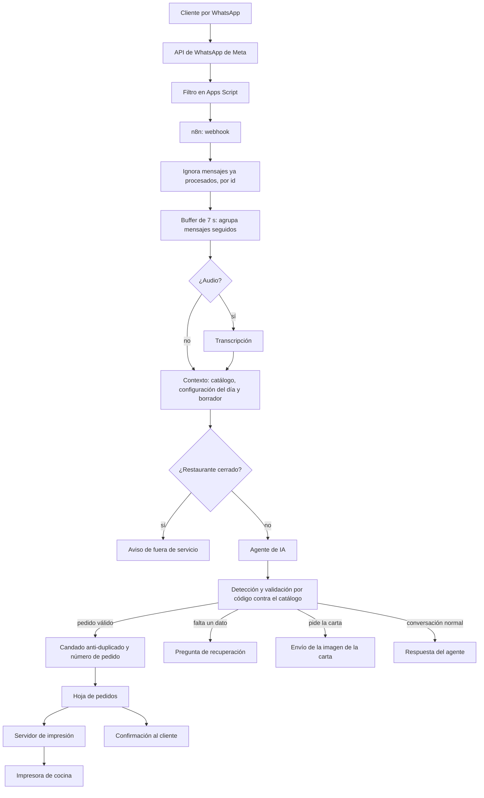

# Contestador automático con IA para tomar pedidos

**Contexto:** proyecto previo al semillero, para un restaurante en Colombia. Diseñado y construido entre mayo y julio de 2026, con ajustes posteriores; ya fue entregado al negocio.

**Herramientas:** n8n, API de WhatsApp Business (Meta), Google Sheets, Google Apps Script, modelo de lenguaje de OpenAI (`gpt-4.1-mini`), servidor de impresión propio.

## Por qué lo construí

Trabajé en el restaurante atendiendo los pedidos y viví el problema de primera mano. El restaurante tenía dos teléfonos y los clientes escribían y llamaban al mismo tiempo, por WhatsApp y por llamada normal. Los domingos eran el pico: yo contestaba una llamada mientras atendía mensajes en el otro teléfono, y en las horas de más demanda llegaban, según mi estimación, unos 500 mensajes en una hora (es un recuerdo de los domingos de mayor demanda, no una medición, y cuenta mensajes, no conversaciones). Si no se respondía rápido, la gente insistía con una llamada o una llamada por WhatsApp, lo que aumentaba la presión. Vi que gran parte de esos mensajes eran repetitivos (la carta, los precios, los horarios y los pedidos) y quise probar si una IA podía tomarlos como lo haría una persona y dejarlos impresos en cocina sin intervención humana.

## Cómo funciona

- El agente conversa con el cliente y, cuando considera que el pedido está completo, emite un bloque estructurado. El código lo extrae, lo valida y solo entonces lo registra.
- Los pedidos se guardan en una hoja de cálculo que funciona como base de datos improvisada y como fuente única de verdad de lo que llega a cocina. Otras hojas guardan el catálogo, la configuración del día, el borrador de cada cliente y los mensajes ya procesados.
- El borrador por cliente conserva lo que el agente ya sabe del pedido (productos, entrega, datos), de modo que no repregunte lo que ya dio.
- Un flujo aparte toma los pedidos manuales y los imprime, con numeración automática para ordenar la cocina.

## Reglas de negocio

Las reglas viven en tres lugares:

- **En el prompt** (unos 49.000 caracteres, en el nodo del agente): el tono, la carta con precios y presentaciones, las reglas de "cero invención", los sinónimos coloquiales (por ejemplo, "gaseosa" es bebida y "cancelar" suele significar pagar), la desambiguación de platos y del pollo, la toma de almuerzos, cuándo y cómo cerrar un pedido, los horarios de atención por WhatsApp, los pagos y qué hacer después del cierre.
- **En la hoja de cálculo:** el catálogo de productos (código, categoría, si requiere color, presentaciones y precios) y la configuración diaria (sopa, principio, proteína y arroz del día, productos agotados). Esta configuración se guarda en caché 30 minutos para no leer la hoja en cada mensaje.
- **En el código:** la validación del pedido (que el producto exista, color Amarillo o Café, tamaño, precio mínimo de los adicionales, teléfono de 10 dígitos que no sea el del restaurante, barrio o nombre), el cálculo del total, la nomenclatura de cocina, el candado anti-duplicado, la numeración y la decisión de qué dato preguntar después.

## Cómo se repartió el trabajo

- **Lo diseñé yo:** las reglas de negocio, el flujo y la arquitectura. Yo decidía qué protecciones hacían falta (filtros, validaciones, restricciones), en qué nodo iba cada una y cómo se estructuraba, y fui perfeccionando el sistema a punta de prueba y error.
- **El código:** durante gran parte del proyecto escribí yo los códigos de los nodos, y la IA me ayudó a pulirlos y a agregar seguridad adicional. En otros momentos le pedí código a partir de mis instrucciones ("un código que restrinja tal cosa", "que valide tal otra", "un filtro para esto"), dándole el contexto del proyecto; aun así, yo decidía dónde iba y cómo se integraba.
- **Con ayuda de IA también:** pulir el system prompt y la documentación.

## Problemas observados

- **Imprevisibilidad:** la IA inventaba productos y sabores que no estaban en la carta, mezclaba nombres de platos distintos (como "arroz chino con pollo y camarón"), olvidaba preguntar datos obligatorios, repetía pedidos y ofrecía productos después del cierre, incluso con esas conductas prohibidas en el prompt. Tres casos reales documentados en el propio prompt:
  - *Cierre fantasma:* la IA confirmó un pedido completo solo con palabras y no generó el bloque técnico. La clienta pidió dos veces que lo cerrara, la IA respondió con agradecimientos y el pedido nunca llegó a cocina.
  - *Pedir permiso para cerrar:* con todos los datos completos, la IA preguntó "¿quieres cerrar tu pedido así?". La clienta creyó que ya había pedido, llegó 20 minutos después y el pedido no estaba registrado.
  - *Dato perdido:* un cliente dio primero su barrio y después una referencia exacta; la IA registró solo la referencia y descartó el barrio.
- **Costos:** se agotó la cuota mensual de ejecuciones de n8n a mitad de ciclo (el 11 de julio). El plan de n8n pasó de $94.000 COP a $200.000 COP, con 10.000 ejecuciones por mes. El consumo del modelo también subió: con el primer modelo (`gpt-4o-mini`), una recarga mínima de $15.000 COP alcanzaba para unos 15 días; con el segundo (`gpt-4.1-mini`) alcanza para una semana, es decir, el gasto se multiplicó por algo más de dos.
  - *Nota sobre la comparación:* según las páginas de OpenAI (consultadas el 30 de septiembre de 2026), `gpt-4o-mini` cuesta $0,15 por millón de tokens de entrada y $0,60 de salida, y `gpt-4.1-mini` cuesta $0,40 y $1,60: unas 2,7 veces más. Esa diferencia es coherente con el gasto que observé, pero no puedo atribuirlo todo al modelo, porque el prompt también creció y el volumen de mensajes cambia de un día a otro. No medí cada factor por separado.

## Qué hice para mejorarlo

1. Cambié el modelo por uno que, según mi observación, sigue mejor las instrucciones (de `gpt-4o-mini` a `gpt-4.1-mini`), aunque el consumo subió.
2. Reforcé las reglas del prompt (cero invención, desambiguación, prevención de duplicados, cierre inmediato); el prompt terminó en unos 49.000 caracteres.
3. Saqué tareas simples de n8n hacia Apps Script y agregué un filtro que descarta eventos innecesarios, para gastar menos ejecuciones.
4. Moví la verificación al código, que es el cambio de fondo. En la primera documentación del proyecto (12 de julio) esta validación figuraba como pendiente; la agregué después:
   - el pedido se valida contra un catálogo guardado en la hoja antes de registrarse;
   - el total y el texto de cocina los calcula el código y no la IA;
   - un borrador por cliente y una regla de "siguiente paso" le dicen al agente qué preguntar;
   - un candado anti-duplicado y una lista de mensajes ya procesados evitan repetir pedidos;
   - un buffer agrupa los mensajes seguidos de un mismo cliente antes de responder.

## Lecciones para mi pregunta de investigación

Mi hipótesis era que escribir reglas en un prompt no garantiza que la IA las cumpla. Este proyecto me la confirmó en un caso real: primero intenté controlar a la IA solo con instrucciones, y como seguía fallando fui moviendo las garantías al código. Lo que quedó es un reparto: la IA entiende el lenguaje libre del cliente (nombres coloquiales, audios, cambios de opinión), y el código garantiza lo que no puede fallar (que el producto exista, que el precio sea correcto, que no haya duplicados, que el pedido llegue a cocina). Además, el prompt no desapareció, creció, así que las capas se suman y no se reemplazan.

También vi en la práctica cómo se reparte el trabajo con la IA: yo decidía qué protección hacía falta y dónde, y la IA me ayudaba a escribir y pulir el código. Según mi experiencia, saber qué pedir y dónde colocarlo fue lo que más pesó, y eso se conecta con mi pregunta de investigación sobre diseñar y estructurar sistemas en lugar de dominar muchos lenguajes.

Esto se relaciona con las fichas anteriores: la ficha 02 mostró cómo se estructuran las instrucciones y por qué hay que evaluarlas, la ficha 03 cómo se da acceso a los datos y herramientas (aquí, el catálogo y el borrador), y la ficha 04 por qué el acceso debe ser mínimo y verificable. Este proyecto es la cuarta pieza: comprobar el resultado fuera del modelo.

## Riesgos y pendientes

- **Entradas sin autenticación:** los dos webhooks de n8n y el filtro de Apps Script aceptan peticiones de cualquiera. Meta envía una firma con cada mensaje dentro de un encabezado HTTP, pero, hasta donde pude comprobar (documentación y foros de Google), Apps Script no da acceso a los encabezados en `doPost`, así que no puede verificar esa firma. Como el filtro está delante de n8n, tampoco n8n recibe la firma original. Opciones que no he implementado: recibir los mensajes en un punto que sí lea encabezados y verifique la firma antes de reenviarlos; hacer que n8n solo acepte peticiones que lleven un secreto compartido con el filtro; y cambiar el token de verificación del webhook, que está escrito en el código, por uno largo y aleatorio guardado como credencial.
- **Servidor de impresión expuesto:** en el flujo, la llamada al servidor de impresión no envía ninguna credencial. Si el servidor no restringe el acceso por otro medio (por ejemplo, una lista de direcciones permitidas), cualquiera que descubra su dirección podría enviar tickets falsos a la cocina.
- **Aviso pendiente al dueño:** conviene informarle de estos tres puntos (webhooks, servidor de impresión y filtro de Apps Script) y corregirlos antes de publicar cualquier detalle técnico de ellos.
- **Precios en varios lugares:** viven en el prompt, en el catálogo y, para los almuerzos, en el código. Si un precio cambia y no se actualiza en todos, el sistema puede contradecirse.
- **Costo por conversación:** el prompt es enorme y además empieza con el contexto dinámico del día. Según la guía de OpenAI que leí (ficha 02), conviene poner al inicio lo que se repite para aprovechar el caché. Mi hipótesis es que reordenar el prompt reduciría el costo; hay que probarlo midiendo el consumo antes y después, porque también podría cambiar el comportamiento del agente.
- **Sin evaluación automática:** el flujo entregado no incluye pruebas automáticas; las pruebas las hice a mano, por prueba y error. Los tres casos reales documentados arriba podrían ser las primeras pruebas para comprobar cada cambio del prompt o del modelo.
